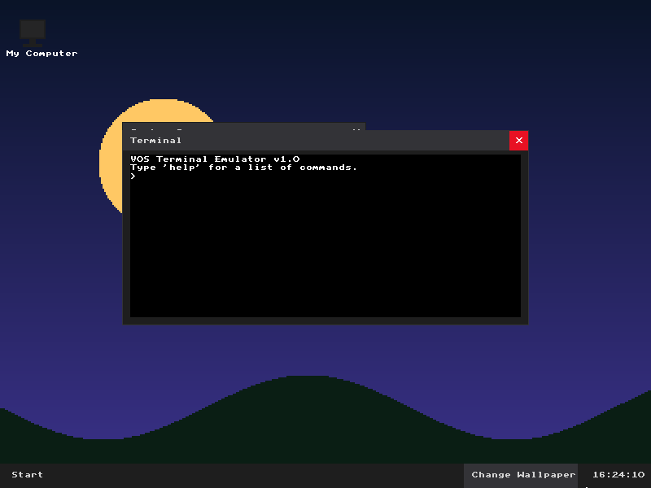
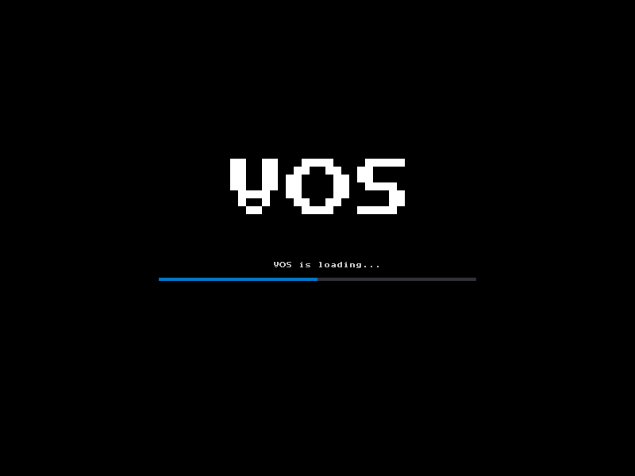
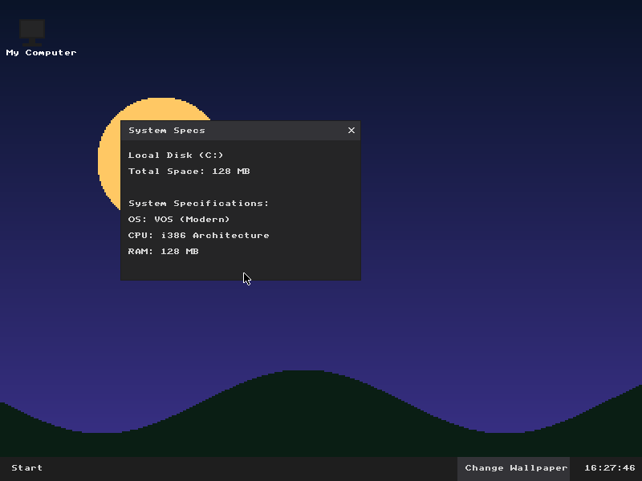

# VOS - A Custom Operating System from Scratch

VOS is a custom, 32-bit graphical operating system written from scratch in C and Assembly. It features a custom bootloader, kernel, memory management, hardware drivers, a modern graphical user interface, a window manager, and a virtual filesystem.

## 🚀 Features

- **Custom Bootloader & Kernel**: Boots into 32-bit protected mode with custom GDT and IDT implementations.
- **Hardware Drivers**: Directly interfaces with the PS/2 Keyboard and Mouse, and CMOS Real-Time Clock (RTC).
- **Graphical Interface**: Interfaces with the Bochs Graphics Adapter (BGA) to provide a smooth 800x600 resolution graphical UI.
- **Window Manager**: Features a completely custom-built window manager with draggable windows, a start menu, and dynamic background rendering.
- **Virtual Filesystem (Initrd)**: Includes a custom Initial Ramdisk format packed with a Python script and unpacked dynamically in memory by the OS.
- **Freestanding C Environment**: Developed without standard libraries, utilizing custom memory operations (`memcpy`, `memset`) and string manipulations.

## 📸 Screenshots

### 1. The Desktop Environment
VOS booting into its modern graphical interface, featuring the Terminal, Real-Time Clock, and Start Menu.


### 2. Boot Screen
The custom boot loading sequence before dropping into the graphical shell.


### 3. System Properties
A draggable "My Computer" window displaying the system capabilities.


## 🛠️ Building & Running

### Requirements
- **Compiler**: `clang` (targeting `i386-pc-none-elf`)
- **Linker**: `lld`
- **Emulator**: `qemu-system-i386`
- **Other**: `make`, `python3`

### Build Instructions
Run the following command to compile the OS, pack the virtual filesystem, and launch it in QEMU:
```bash
make run
```

## 🏗️ Architecture
- `boot/`: Bootloader and linker scripts.
- `cpu/`: GDT, IDT, and Interrupt Service Routines (ISRs).
- `mm/`: Physical Memory Management (PMM).
- `drivers/`: Keyboard, mouse, timer, RTC, BGA (Graphics), and VGA drivers.
- `kernel/`: Kernel entry point and filesystem drivers.
- `gui/`: Desktop environment, window manager, and terminal rendering logic.
- `fs/`: Contains the text files that get packed into the virtual filesystem (`initrd`).
